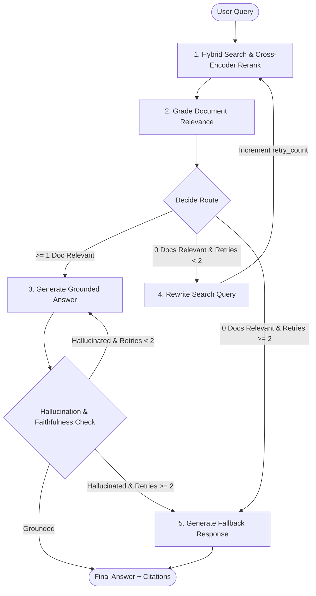

# 🧠 Self-Reflective Corrective RAG (CRAG) Agent

A production-grade, self-reflective **Corrective Retrieval-Augmented Generation (CRAG)** Agent in Python built with **LangGraph**, **Qdrant**, **FastEmbed/HuggingFace Embeddings**, **BM25**, **Cross-Encoder Reranking**, and **RAGAS** evaluation.

---

## 🌟 Key Features

1. **Layout-Aware Ingestion (`src/ingestion.py`)**:
   - Parses complex PDF documents (extracting clean Markdown, headers, and tables via `PyMuPDF4LLM`), raw Markdown, and Text files.
   - `RecursiveCharacterTextSplitter` configured for semantic boundary preservation ($600$ characters, $80$ overlap).

2. **Hybrid Search Indexing (Qdrant + BM25)**:
   - **Dense Vectors**: `BAAI/bge-small-en-v1.5` embeddings stored in local / in-memory **Qdrant**.
   - **Sparse Vectors**: Exact-keyword matching via **BM25Okapi**.
   - **Ensemble Fusion**: Weighted normalized scoring ($0.6 \times \text{Dense} + 0.4 \times \text{Sparse}$) for superior recall and precision.

3. **Cross-Encoder Reranker (`src/reranker.py`)**:
   - `cross-encoder/ms-marco-MiniLM-L-6-v2` re-ranks top-K candidate chunks down to top-3 highest-relevance passages.

4. **Self-Reflective LangGraph State Machine (`src/agent_graph.py`)**:
   - **`retrieve_and_rerank`**: Fetches and re-scores candidates.
   - **`grade_documents`**: Evaluates chunk relevance against query intent, discarding noise.
   - **`rewrite_query`**: Triggers semantic query transformation and re-retrieves when initial search fails.
   - **`generate_answer`**: Synthesizes responses strictly grounded on vetted chunks with in-text citation tags (`[Doc 1]`, `[Doc 2]`).
   - **`hallucination_check`**: Reflection loop verifying answer faithfulness against vetted source context before final delivery.
   - **`generate_fallback`**: Gracefully admits lack of context when maximum retries are reached.

5. **Automated RAGAS Benchmark Suite (`src/evaluate.py`)**:
   - 10 synthetic test cases spanning factual, architectural, policy, and edge-case queries.
   - Computes **Faithfulness**, **Answer Relevancy**, **Context Precision**, and **Context Recall**.
   - Exports reports in both **JSON** and **CSV** formats.

6. **Interactive Streamlit Web UI (`app.py`)**:
   - Dark mode dashboard with glassmorphism styling.
   - Drag-and-drop document upload and re-indexing.
   - Live step-by-step agent execution trace inspector.
   - RAGAS evaluation dashboard with gauges and charts.
   - Document chunk explorer.

7. **FastAPI & CLI Support (`main.py`)**:
   - Headless query execution, batch evaluation, and REST API serving.

---

## 🏗️ State Machine Architecture



---

## 📁 Project Structure

```
crag-agent/
├── data/
│   ├── sample_docs/
│   │   ├── attention_is_all_you_need_summary.md
│   │   ├── crag_paper_summary.md
│   │   └── enterprise_ai_policy.txt
│   └── qdrant_db/
├── src/
│   ├── __init__.py
│   ├── config.py             # Settings, model configs, environment loader
│   ├── ingestion.py          # PyMuPDF4LLM parser, chunking, Qdrant + BM25 hybrid store
│   ├── reranker.py           # Cross-Encoder (ms-marco-MiniLM-L-6-v2) scoring & filtering
│   ├── agent_graph.py        # LangGraph StateGraph, CRAG state machine, reflection loops
│   ├── llm_factory.py        # Unified LLM provider (OpenAI, Gemini, Anthropic, Groq, Smart Local)
│   └── evaluate.py           # RAGAS evaluation runner, synthetic dataset & reporting
├── tests/
│   ├── __init__.py
│   └── test_pipeline.py      # Full unit & integration test suite
├── app.py                    # Streamlit Web UI with live execution trace & evaluation dashboard
├── main.py                   # CLI and FastAPI REST API entry point
├── requirements.txt          # Production dependencies
├── .env.example              # Environment variables template
└── README.md                 # Complete documentation
```

---

## 🚀 Quick Start Guide

### 1. Installation

```bash
# Clone or navigate to the directory
cd "RAG project"

# Install dependencies
pip install -r requirements.txt
```

### 2. Configure Environment (Optional)

Create a `.env` file based on `.env.example`:

```bash
cp .env.example .env
```

*(Note: If no API keys are provided, the system automatically falls back to its built-in Smart Rule-Based Engine for offline execution and testing.)*

### 3. Run the Interactive Streamlit Web App

```bash
streamlit run app.py
```

Open your browser at `http://localhost:8501` to access:
- **Interactive Chat & Execution Trace**: Ask questions, upload documents, and inspect real-time reflection steps.
- **RAGAS Benchmark Dashboard**: Trigger automated evaluations, review metrics, and download reports.
- **Chunk Explorer**: Search and inspect indexed vector records.

### 4. Run via Command Line Interface (CLI)

```bash
# Ask a direct question
python main.py --query "What is the scaling factor in scaled dot-product attention?"

# Run the 10-query benchmark evaluation
python main.py --evaluate

# Launch interactive CLI loop
python main.py
```

### 5. Launch FastAPI REST Server

```bash
python main.py --serve --port 8000
```

Access OpenAPI documentation at `http://127.0.0.1:8000/docs`.

---

## 🧪 Running Automated Tests

Run the test suite with `pytest`:

```bash
pytest tests/test_pipeline.py -v
```

---

## 📊 Evaluation Metrics

The benchmark suite computes four key RAG quality metrics across 10 diverse test cases:

| Metric | Description | Target |
| :--- | :--- | :--- |
| **Faithfulness** | Measures if the answer is strictly grounded in the vetted context | $> 0.85$ |
| **Answer Relevancy** | Assesses how directly the answer addresses the user query | $> 0.80$ |
| **Context Precision** | Measures if the most relevant chunks are ranked at the top | $> 0.75$ |
| **Context Recall** | Evaluates coverage of ground-truth reference facts | $> 0.80$ |

Reports are automatically exported to:
- `data/ragas_benchmark_report.json`
- `data/ragas_benchmark_report.csv`

---

## 🛡️ License & Attribution
MIT License. Built for advanced agentic AI architectures.
