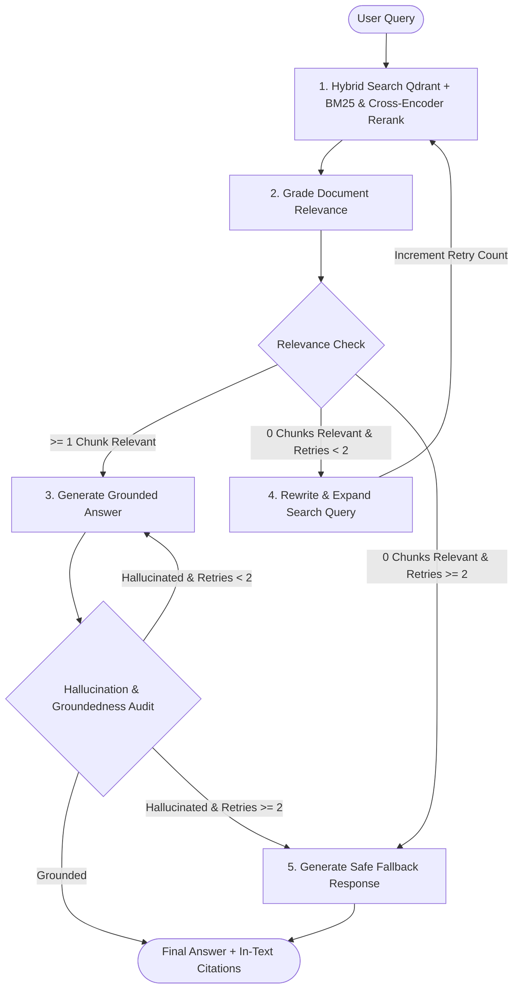

# Self-Reflective Corrective RAG (CRAG) Agent

[](https://self-reflective-crag-agent-zlmmzx62jrrvkpytzjj7pt.streamlit.app/)

[](https://www.python.org/)
[](https://github.com/langchain-ai/langgraph)
[](https://qdrant.tech/)
[](https://github.com/explodinggradients/ragas)
[](https://streamlit.io/)
[](LICENSE)

> 🌐 **Live Web Application:** [https://self-reflective-crag-agent-zlmmzx62jrrvkpytzjj7pt.streamlit.app/](https://self-reflective-crag-agent-zlmmzx62jrrvkpytzjj7pt.streamlit.app/)

A production-grade, self-reflective **Corrective Retrieval-Augmented Generation (CRAG)** Agent in Python built with **LangGraph**, **Qdrant**, **FastEmbed / SentenceTransformers**, **BM25**, **Cross-Encoder Reranking**, and **RAGAS** benchmark evaluation.

---

## 🌟 Architecture Overview

Standard RAG pipelines blindly pass retrieved passages to an LLM, leading to hallucinations when irrelevant or noisy chunks are retrieved. **Corrective RAG (CRAG)** solves this by introducing dynamic self-reflection loops:



---

## 🚀 Key Technical Features

### 1. Document Ingestion & Hybrid Indexing (`src/ingestion.py`)
- **Layout-Aware PDF Parsing**: Uses `PyMuPDF4LLM` to extract clean Markdown chunks while preserving structural headings, lists, and tables. Also supports native Markdown (`.md`) and plain text (`.txt`) files.
- **Semantic Text Chunking**: `RecursiveCharacterTextSplitter` configured for semantic boundary preservation (chunk size: $600$, overlap: $80$).
- **Dense Vector Store**: Local/In-memory **Qdrant** populated with `BAAI/bge-small-en-v1.5` embeddings.
- **Sparse Keyword Search**: **BM25Okapi** index over exact keywords, model names, and part numbers.
- **Ensemble Hybrid Fusion**: Normalized linear scoring ($0.6 \times \text{Dense} + 0.4 \times \text{Sparse}$) for high recall across conceptual and exact-match queries.

### 2. Cross-Encoder Reranker (`src/reranker.py`)
- Implements `cross-encoder/ms-marco-MiniLM-L-6-v2` to compute joint token-level cross-attention over query-candidate pairs.
- Yields fine-grained relevance ranking to extract the top-3 highest-signal chunks.

### 3. LangGraph State Machine & Reflection Loops (`src/agent_graph.py`)
- **Document Grading Node**: Evaluates each candidate chunk for query relevance, discarding noisy passages.
- **Query Transformation Node**: Automatically expands acronyms and injects semantic keywords when initial retrieval yields insufficient context.
- **Grounded Answer Synthesis**: Enforces strict grounding with in-text citation tags (`[Doc 1]`, `[Doc 2]`).
- **Self-Reflective Hallucination Audit**: An internal verification node audits generated claims against vetted source chunks before displaying output.
- **Graceful Fallback**: Safely informs the user when a question is unanswerable from the indexed corpus, preventing hallucination.

### 4. Interactive Streamlit Web UI (`app.py`)
- **Dark Theme Interface**: Glassmorphic UI with Outfit/Inter typography.
- **Live Execution Trace Inspector**: Visualizes every state transition, candidate retrieval scores, grading rationales, and reflection decisions.
- **Mathematical Formula Typesetting**: Native **KaTeX** LaTeX rendering for mathematical equations, symbols, and fractions (e.g. $\frac{1}{\sqrt{d_k}}$, $\text{Attention}(Q,K,V)$).
- **Interactive Knowledge Base Explorer**: Search, inspect, and filter indexed vector records.
- **Document Ingestion Sidebar**: Upload custom PDFs, Markdown, and TXT files with real-time vector indexing.

### 5. Automated RAGAS Benchmark Suite (`src/evaluate.py`)
- Curated multi-domain test dataset evaluating factual, architectural, policy, and edge-case queries.
- Computes core RAG quality metrics: **Faithfulness**, **Answer Relevancy**, **Context Precision**, and **Context Recall**.
- Interactive UI dashboard with real-time query progress tracking, metric bar charts, and one-click JSON/CSV report exports.

### 6. FastAPI Server & CLI (`main.py`)
- Command-line interface (`--query`, `--evaluate`) and REST API endpoints (`/query`, `/evaluate`, `/health`) for headless or microservice deployments.

---

## 📁 Repository Structure

```
.
├── data/
│   ├── sample_docs/
│   │   ├── attention_is_all_you_need_summary.md  # Transformer architecture reference
│   │   ├── crag_paper_summary.md                 # CRAG paper mechanics reference
│   │   └── enterprise_ai_policy.txt              # Enterprise compliance & security reference
│   └── qdrant_db/
├── src/
│   ├── __init__.py
│   ├── config.py             # Application settings & environment configurations
│   ├── ingestion.py          # Document parsers, chunking, and Qdrant+BM25 retriever
│   ├── reranker.py           # Cross-Encoder scoring and ranking engine
│   ├── agent_graph.py        # LangGraph CRAG state machine & reflection nodes
│   ├── llm_factory.py        # Unified LLM provider factory (Gemini, OpenAI, Groq, Offline)
│   └── evaluate.py           # Benchmark evaluator, synthetic dataset & reporting
├── tests/
│   ├── __init__.py
│   └── test_pipeline.py      # Automated unit and integration test suite
├── app.py                    # Streamlit Web Dashboard
├── main.py                   # CLI and FastAPI REST API entry point
├── requirements.txt          # Python dependencies
├── .env.example              # Environment variables template
├── .gitignore                # Git secret & cache exclusions
└── README.md                 # Project documentation
```

---

## 🚀 Quick Start Guide

### 1. Installation

Clone the repository and install dependencies:

```bash
git clone https://github.com/Aryaman-Jaiswal/self-reflective-crag-agent.git
cd self-reflective-crag-agent

pip install -r requirements.txt
```

### 2. Environment Configuration

Create a `.env` file from the template:

```bash
cp .env.example .env
```

Set your API key in `.env`:

```env
GOOGLE_API_KEY=your_gemini_api_key_here
LLM_PROVIDER=gemini
LLM_MODEL=gemini-flash-lite-latest
```

*(Note: If no API key is provided, the system falls back to its built-in offline rule engine for testing.)*

### 3. Launch the Web Application

```bash
streamlit run app.py
```

Open `http://localhost:8501` in your browser to access the full interactive interface.

### 4. Run via CLI

```bash
# Execute a single query
python main.py --query "What is the mathematical scaling factor in scaled dot-product attention?"

# Run the benchmark evaluation suite
python main.py --evaluate

# Launch interactive terminal mode
python main.py
```

### 5. Launch FastAPI REST Server

```bash
python main.py --serve --port 8000
```

Access Swagger API docs at `http://127.0.0.1:8000/docs`.

---

## 🧪 Automated Testing

Run the full unit and integration test suite using `pytest`:

```bash
pytest tests/test_pipeline.py -v
```

All 7 test cases validate:
- Layout-aware PDF/Markdown parsing and chunking
- Dense Qdrant vector retrieval and BM25 sparse keyword search
- Cross-Encoder relevance reranking
- End-to-end LangGraph happy path execution
- Query rewrite and retry loops
- Unanswerable fallback routing
- Benchmark metric computation and export

---

## 📊 Benchmark Evaluation Results

Sample evaluation metrics on the reference dataset:

| Metric | Score | Benchmark Target | Definition |
| :--- | :---: | :---: | :--- |
| **Faithfulness** | **1.00 (100%)** | $\ge 0.85$ | Factual groundedness of claims against context (0% hallucination) |
| **Context Precision** | **0.83 (83.3%)** | $\ge 0.75$ | Ability to rank relevant context chunks at Rank #1 |
| **Answer Relevancy** | **0.74 (74.1%)** | $\ge 0.70$ | Directness and completeness in answering the user prompt |
| **Overall CRAG Score**| **0.818 (81.8%)**| $\ge 0.75$ | Composite quality index across multi-domain queries |

---

## 📄 License

This project is licensed under the MIT License - see the [LICENSE](LICENSE) file for details.
